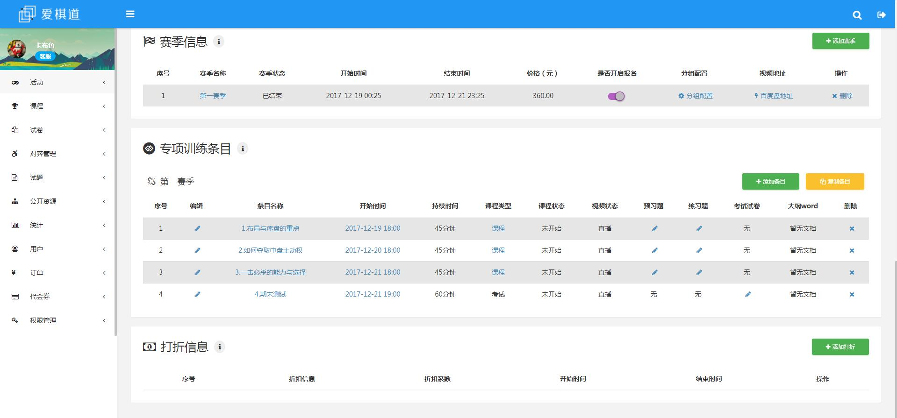

# 联系方式

- 手机：13552232913
- Email：13552232913@163.com
- 微信号：zhai359118915
- QQ：359118915

# 个人信息

 - 翟浩然/男/1992
 - 本科/中国农业大学(985)
 - 工作年限：3年
 - Github：https://github.com/zhaihaoran
 - 期望职位：JS前端开发,Web前端开发
 - 期望城市：北京，杭州

# 工作经历

### 2018.2 ~~ 2018.4 [途梦公益教育](#)

#### 项目介绍：

途梦主要为偏远贫困学校和社会人士提供一个良好的在线授课平台，致力于邀请各行各业的成功人士在途梦上为偏远贫困地区的孩子了解更广阔的世界，获得更优质的教育。

#### 工作内容：

负责途梦网站主站、梦享家、学校、途梦三个运营后台前端架构的整体搭建、设计、部署、实现和维护。

#### 技术介绍：

- 主站前端技术架构搭建基于ES6 + Bootstrap4 + webpack + scss + Axios等功能上集成了分页、分享、视频播放等功能，其中webpack脚手架均为自己搭建配置。
- 主站页面兼容IE9+、Firefox、Chrome,所有页面均为响应式设计、SEO表现良好；
- 代码上变量函数命名遵从驼峰命名标准、语义化、结构清楚、注释清晰。页面模板渲染采用smarty生成。
- 后台前端技术技术栈为 Vue + Vue-Router + Vuex + ES6 + Scss + Axios + ElementUI和一些自制组件，功能方面包含了常用的增删改查、拖拽、视频上传、播放、聊天等功能。 项目设计模块化良好，层次清晰；
- 后台技术方面,axios经过二次封装，统一调用，vue上运用了mixin、slot等抽离出部分逻辑、路由上包含了组件懒加载、权限判断、载入前Loading等特性;vuex按module划分，结构清晰。
- 后台数据是通过公共平台apimock模拟接口、利用webpack-dev-server的proxy反向代理，完全实现前后端分离、提升开发效率。

### 2016.2~~2018.1 [爱棋道文化传播有限公司](http://www.iqidao.com) 

#### 项目介绍： 

爱棋道是专注于围棋在线教育的网上学校，其创立的在线视频课堂技术，自主研发的教材与教学方式，为学生们提高水平提供了超越传统学习方式的全新途径，目前隶属于好未来旗下。

#### 工作内容： 

负责公司运营后台前端重构、业务功能开发；公司活动落地页设计与实现；研发教师上课工具；

#### 技术介绍

* 运营后台主要面向所有运营、教务、客服等工作人员进行日常维护，业务涵盖了公司所有产品相关的数据支持，包括课程、活动、用户、试卷、题库等等方面。具体功能点包含了基本的信息展示、增删该查、权限管理、数据可视化、数据导出、视频文档和课件上传、新闻专栏富文本编辑等。
* 后台前端采用的是服务器渲染+传统多页面的研发方案，技术稳定且成本较低，易于迭代。核心技术栈为 RequireJs + ES5 + Gulp + Less + Documentation + 第三方开源插件，HTML为Go template 渲染生成。整体版本十分稳定、功能齐全；兼容IE9+，Firefox，Chrome;移动端适配，获得一致好评。
* 前端整体基于AMD模块化开发,多页面通用组件统一声明,自制工具类util,二次封装组件等工作以支持页面js的工作,抽象度较高,逻辑结构清晰。
* 高度集成了各种第三方开源组件并进行二次封装确保正常，具体包含富文本编辑（froalaEditor），远程下拉框（select2），日期选择（datetimepicker）等等。
* 缓存策略方面采用长期cache同时结合依赖文件添加版本号来确保网页性能和线上及时更新，对前端性能优化有一定了解。
* js严格遵循eslint要求、代码风格为面向对象、模块化开发;驼峰命名变量;熟练掌握注释语法以确保Documentation正常生成js接口文档。
* 后端方面技术栈为 golang + iris + mysql,熟练使用go语言进行路由编写，部分接口编写；熟练掌握sql、mysql进行数据库增删该查方便进行调试。

# 兴趣作品 

#### 数独游戏  -- [数独游戏](https://zhaihaoran.github.io/resume/)

#### hexo博客  -- [卡布鲁 | 杂食堆](https://zhaihaoran.github.io/)

#### Nextjs 同构应用 -- [ demo ](https://github.com/zhaihaoran/next-admin-demo)

* 采用 Nextjs + React + Mobx + AntDesign + Koa + Mysql 搭建的网站架构雏形，假数据用puer-mock生成，为后期重构和新项目做技术储备。

#### 其他小作品和封装组件

* 俄罗斯方块 --`terris.js` [demo](https://zhaihaoran.github.io/resume/terris.html)
* 移动端九宫格解锁实现 -- `gesture.js` [demo](https://zhaihaoran.github.io/resume/unlock.html)

# 自我评价

 - 熟练掌握及使用Vue及周边生态、后台业务功能点基本完全覆盖
 - 熟练使用ES5、ES6进行日常前端开发
 - 熟练使用chrome调试工具进行调试
 - 熟练使用Bootstrap、AJAX、jQuery、RequireJS进行传统前端模式开发
 - 对HTTP协议有一定理解、对页面性能优化、响应有一定理解，代码风格良好，注释清楚，命名规范
 - 熟练使用webpack、gulp、git、gitlab等工具
 - 熟练使用HTML5、CSS3、Scss、Less、flex、Iconfont进行日常页面布局和切图
 - 熟练使用mac进行日常开发、有笔记习惯
 - 了解Nuxt、React及周边生态，有demo经验
 - 独立自主解决问题能力很强，时常翻墙google和stackoverflow解决bug。
 - 对新技术充满热情、热爱交流，时常翻阅掘金和大牛博客提升姿势、弥补技术短板，在后台业务功能模块设计上有一定经验和产品思维
 - 目前户口落户于北京市昌平区沙河县派出所 

# 致谢

感谢您花时间阅读我的简历，如有疑问欢迎留言，期待能有机会与您共事。

